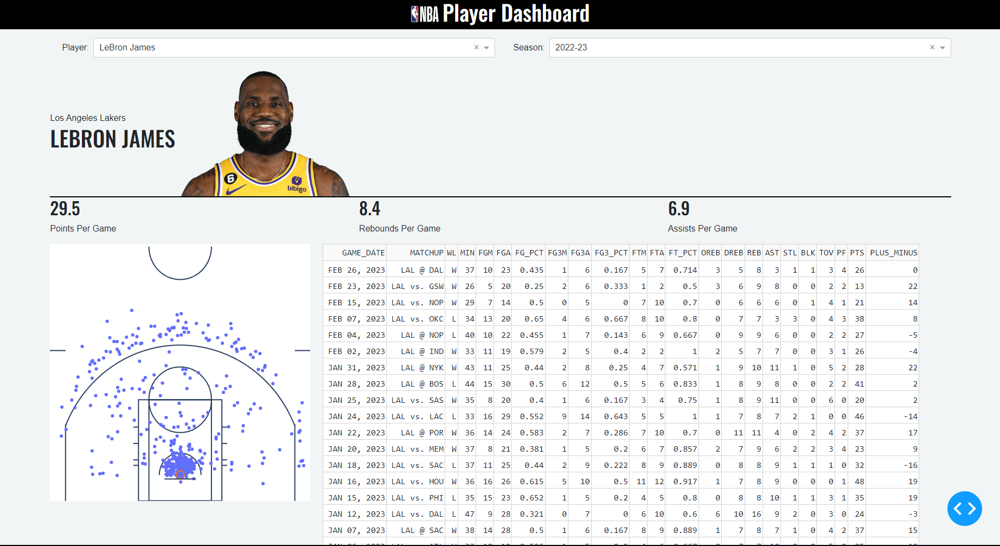

# NBA Player Dashboard

An interactive dashboard built with Plotly Dash for visualising the performance of any NBA player



## Try it Out

### Run it Yourself

Install required modules with:

```{shell}
pip install -r requirements.txt
```

Next, run the dashbord with:

```{shell}
python app.py
```

Once app is running, visit [http://127.0.0.1:8050/](http://127.0.0.1:8050/) in your web browser.